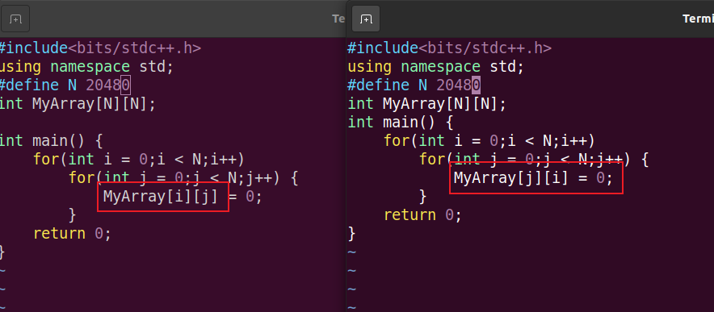
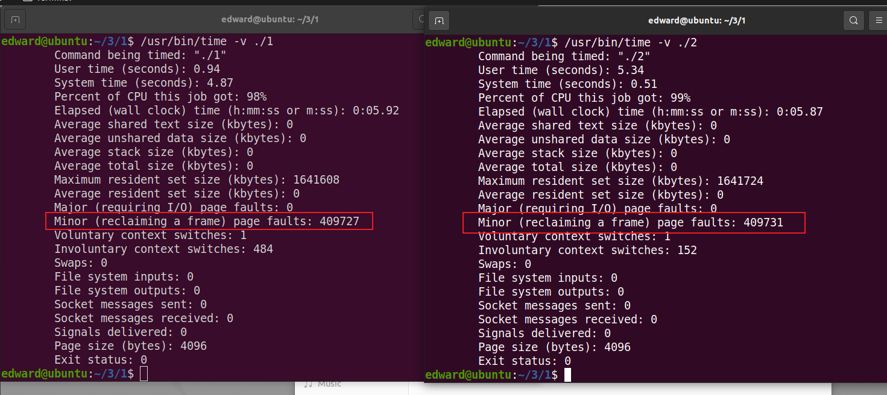
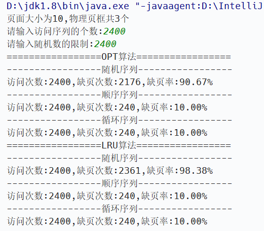
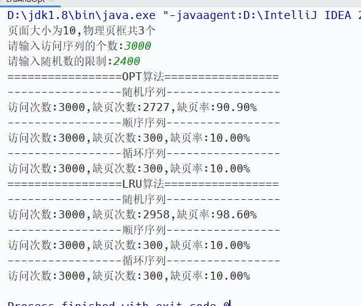
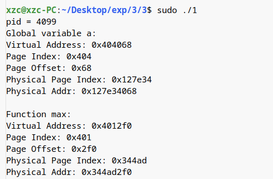

# 第三次实验

# 1）理解程序运行局部性的原理

先写出两个cpp文件



用g++命令编译两个cpp文件，得到1和2两个文件

用 `/usr/bin/time -v ./1`和 `/usr/bin/time -v ./2`命令运行两个程序



可以看到两个程序缺页次数相差不大，2的缺页次数更多一些。

# 2）Windows模拟实现OPT和LRU淘汰算法

这里因为只是实现算法，我用擅长的java语言写。

LruAndOpt.java

```JAVA
package com.xzc;

import java.util.HashMap;
import java.util.Map;
import java.util.Random;
import java.util.Scanner;

/**
 * @author U201916322 Xu Zichuan
 */
public class LruAndOpt {
    // 设置页面大小为10
    private final int pageSize = 10;

    public static void main(String[] args) {

        LruAndOpt lao = new LruAndOpt();
        System.out.println("页面大小为10,物理页框共3个");
        System.out.print("请输入访问序列的个数:");
        Scanner sc = new Scanner(System.in);
        int n = sc.nextInt();
        System.out.print("请输入随机数的限制:");
        int limit = sc.nextInt();
        final Random r = new Random();
        int[] A1 = new int[n];
        for (int i = 0; i < n; i++) {
            A1[i] = r.nextInt(limit);
        }
        int[] A2 = new int[n];
        for (int i = 0; i < n; i++) {
            A2[i] = i;
        }
        int[] A3 = new int[n];
        for (int i = 0; i < n; i++) {
            A3[i] = i % 100;
        }
        System.out.println("=================OPT算法=================");
        System.out.println("-----------------随机序列-----------------");
        lao.Opt(A1);
        System.out.println("-----------------顺序序列-----------------");
        lao.Opt(A2);
        System.out.println("-----------------循环序列-----------------");
        lao.Opt(A2);
        System.out.println("=================LRU算法=================");
        System.out.println("-----------------随机序列-----------------");
        lao.Lru(A1);
        System.out.println("-----------------顺序序列-----------------");
        lao.Lru(A2);
        System.out.println("-----------------循环序列-----------------");
        lao.Lru(A2);
    }

    public int getPageNumber(int address) {
        return address / pageSize;
    }

    public void Opt(int[] A) {
        int count = 0;
        int n = A.length;
        Map<Integer, Integer> pageMap = new HashMap<>();
        // 顺序访问
        for (int i = 0; i < n; i++) {
            int page = getPageNumber(A[i]);
            if (i == 0) {
                // 第一次访问一定缺页
                count++;
                pageMap.put(page, 1);
            } else {
                // 若不缺页则不作处理 下面处理缺页
                // 我们自己设定物理页框就3个
                if (!pageMap.containsKey(page)) {
                    count++;
                    if (pageMap.size() == 1) {
                        pageMap.put(page, 2);
                    } else if (pageMap.size() == 2) {
                        pageMap.put(page, 3);
                    } else {
                        // 要淘汰的页号是最远的将来第一次出现的那一页
                        // eliminate 要淘汰的页号
                        int eliminate = 0, latest = 0;
                        // 对于页表里的逻辑页k
                        for (int k : pageMap.keySet()) {
                            boolean found = false;
                            int time = 0;
                            for (int j = i + 1; j < n; j++) {
                                if (k == getPageNumber(A[j])) {
                                    found = true;
                                    time = j;
                                    break;
                                }
                            }
                            if (found) {
                                if (latest < time) {
                                    latest = time;
                                    eliminate = k;
                                }
                            } else {
                                //以后的元素都没有第k页的 直接淘汰
                                eliminate = k;
                                break;
                            }
                        }
                        int phy = pageMap.get(eliminate);
                        pageMap.remove(eliminate);
                        pageMap.put(page, phy);
                    }
                }
            }
        }
        System.out.println("访问次数:" + n + ",缺页次数:" + count + ",缺页率:"
                + String.format("%.2f", ((double) count / n * 100)) + "%");
    }

    public void Lru(int A[]) {
        int n = A.length;
        int count = 0;
        Map<Integer, Integer> pageMap = new HashMap<>();
        for (int i = 0; i < n; i++) {
            int page = getPageNumber(A[i]);
            if (i == 0) {
                // 第一次访问一定缺页
                count++;
                pageMap.put(page, 1);
            } else {
                // 若不缺页则不作处理 下面处理缺页
                if (!pageMap.containsKey(page)) {
                    count++;
                    if (pageMap.size() == 1) {
                        pageMap.put(page, 2);
                    } else if (pageMap.size() == 2) {
                        pageMap.put(page, 3);
                    }else{
                        // 要淘汰的页号是从当前页前一页开始往前扫描最后一个出现的
                        // eliminate 要淘汰的页号
                        int eliminate = 0, latest = Integer.MAX_VALUE;
                        int k = 0;
                        for (int j = i - 1;j >= 0;j--){
                            if (pageMap.containsKey(getPageNumber(A[j])) && latest > j){
                                latest = j;
                                k++;
                                eliminate = getPageNumber(A[j]);
                                if (k == 3){
                                    break;
                                }
                            }
                        }
                        int phy = pageMap.get(eliminate);
                        pageMap.remove(eliminate);
                        pageMap.put(page, phy);
                    }
                }
            }
        }
        System.out.println("访问次数:" + n + ",缺页次数:" + count + ",缺页率:"
                + String.format("%.2f", ((double) count / n * 100)) + "%");
    }
}

```

这里我设置页面大小为10，页框为3个，看实验结果





# 3）Linux下计算某个变量或函数虚拟地址对应的物理地址等信息

我们写如下cpp文件

1.cpp

```CPP
#include <stdio.h>
#include <unistd.h>
#include <stdint.h>
#include <stdlib.h>
#include <inttypes.h>
#include <string.h>

//获取物理地址 //va为虚拟内存地址
void VA2PA(unsigned long va) {     
    //页面大小
    size_t pageSize = getpagesize();    
    //页号
    unsigned long pageIndex = va / pageSize;
    //页内偏移
    unsigned long offset = va % pageSize;   
    FILE* fp;
    printf("Virtual Address: 0x%lx\n",va);
    printf("Page Index: 0x%lx\nPage Offset: 0x%lx\n", pageIndex, offset);
    if((fp=fopen("/proc/self/pagemap", "rb")) == NULL) {
        printf("Error!\n");
        return;
    }
    unsigned long fileOffset = pageIndex * sizeof(uint64_t);
    if(fseek(fp,fileOffset,SEEK_SET)!=0) {
        printf("Error!\n");
        return;
    }

    if(fread(&it,sizeof(uint64_t),1,fp) != 1) {
        printf("Error!\n");
        return;
    }
    fclose(fp);
    //第63位记录当前页面位置：1为在物理内存中，0表示不在物理内存中
    if((it >> 63) & 1 == 0) {
        printf("Page Present is 0.\nNot in the Physical Memory.\n");
        return;
    }
    //0-54位为物理页号
    uint64_t pPageIndex = (((uint64_t)1 << 55) - 1) & it;
    printf("Physical Page Index: 0x%" PRIx64 "\n",pPageIndex);
    //物理地址 = 物理页号*页大小+页内偏移
    unsigned long pa = pPageIndex * pageSize + offset;
    printf("Physical Address: 0x%lx\n\n", pa);
}

int a = 1000;

int max(int a, int b) {
    return a >= b ? a : b;
}

int main() {
    printf("pid = %d\n", getpid());
    printf("Global variable a:\n");
    VA2PA(&a);
    printf("Function max:\n");
    VA2PA(&max);

    return 0;

}
```

我们定义了一个全局变量a，一个函数max，通过运行该程序查看该变量a和该函数max的虚拟地址，虚拟页号，页内偏移，物理地址，物理页号：

