# 实验环境

Windows 10 x64

VMWare 16.2.1

Kali GNU/Linux Rolling x86_64

IDA PRO-7.0

QEMU-7.0.0

# 注意

本人实验二用的老lib，新lib无法采用本方法，附参考博客：

- https://blog.csdn.net/qq_46106285/article/details/125116966?spm=1001.2014.3001.5501
- https://blog.csdn.net/qq_46106285/article/details/125455204?spm=1001.2014.3001.5501
- https://blog.csdn.net/qq_46106285/article/details/125464654?spm=1001.2014.3001.5501

# 实验过程

## flag1

### 过程

用IDA pro打开task1_23.elf

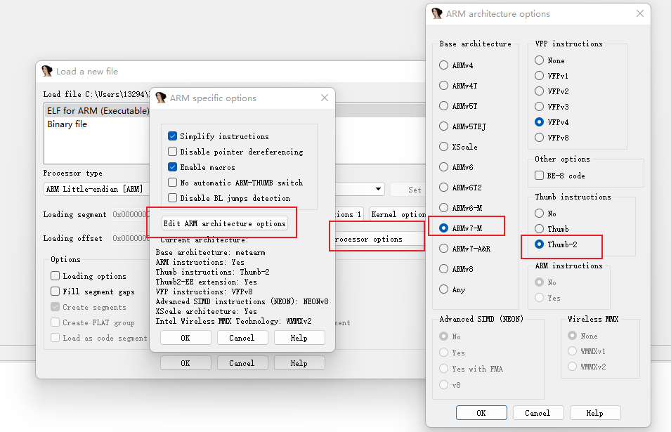

然后点开`main`函数，按`f5`反汇编


经过分析，main函数功能有下：

显示输入提示字符串，接收四字符的输入，存到aRxBuffer，显示aRxBuffer和'\n'五个字符，调用HelpFunc()以及其他函数。

双击HelpFunc()

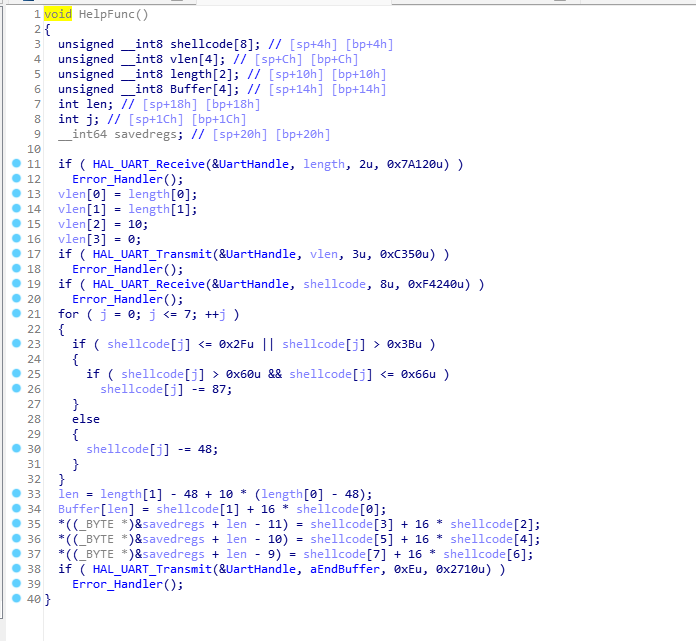

显然这里就是溢出函数

因为`len`是自己输入的，所以能够赋任意值到任意地址上去。我们这里覆盖掉函数的返回值就行。

在text view找到

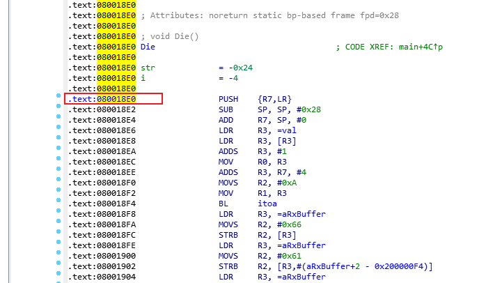

起始地址 `080018E0`

在helpfunc里双击sp变量打开栈空间

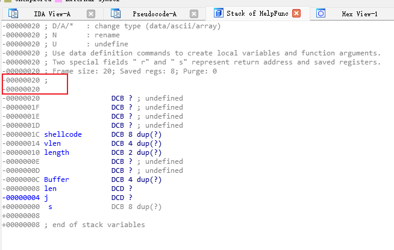

len=Buffer与BP的距离+4 = 0x0C+4 = 16(10进制)

所以shellcode如下

> 6322
>
> 16
>
> E1180008

### 测试

kali先安装好qemu

然后到qemu-7.0.0/build/bin目录下开启终端

执行命令

```bash
sudo ./qemu-system-arm -M netduinoplus2 -cpu cortex-m4 -m 16M -nographic -d in_asm,nochain -kernel task1_23.elf -D log.txt
```


## flag2

### 背景知识

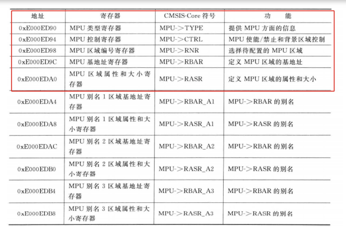

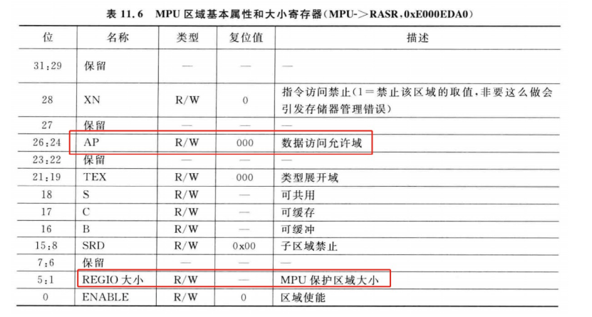

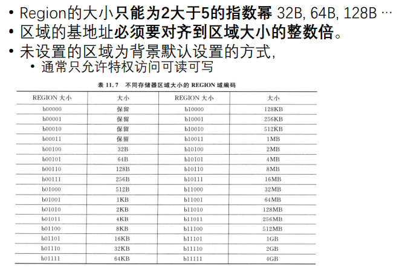

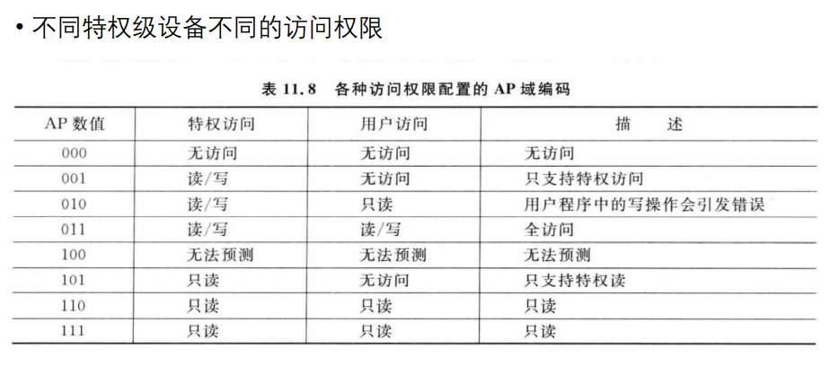

### 测试

安装keil并破解 新建project 导入文件 编译运行 报错

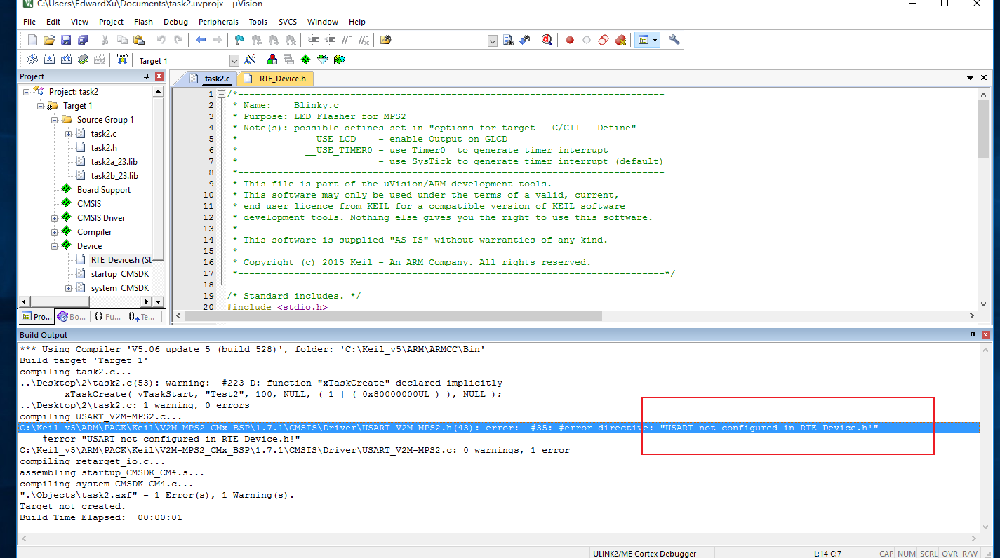

根据error提示修改 RTE_Device.h 文件UART0 为 1


随后修改task2.c文件

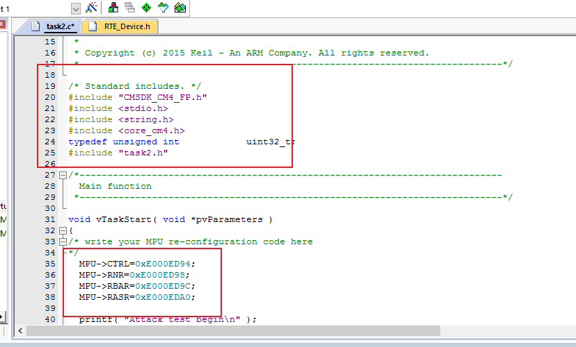

这里改学号后四位

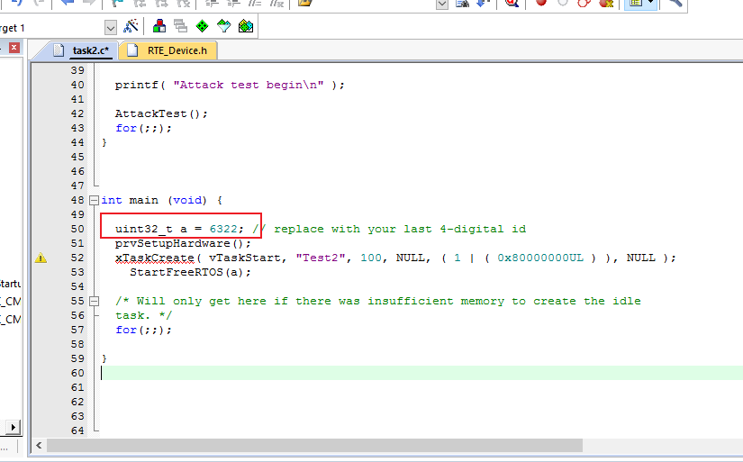


成功编译


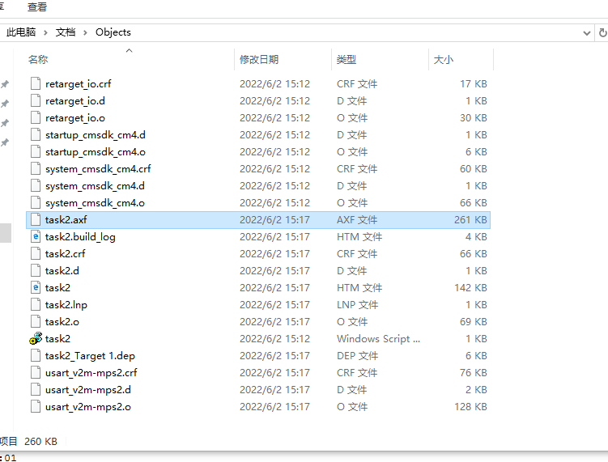

把得到的task2.axf复制到qemu7.0.0/build/bin下

然后执行

```bash
sudo ./qemu-system-arm -M mps2-an386 -cpu cortex-m4 -m 16M -nographic -d in_asm,nochain -kernel task2.axf -D log.txt
```


## flag3

### 背景知识

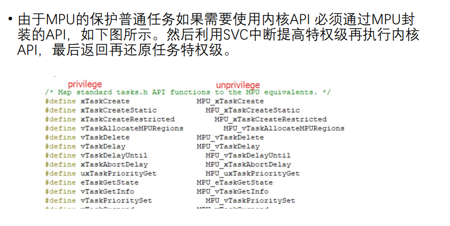

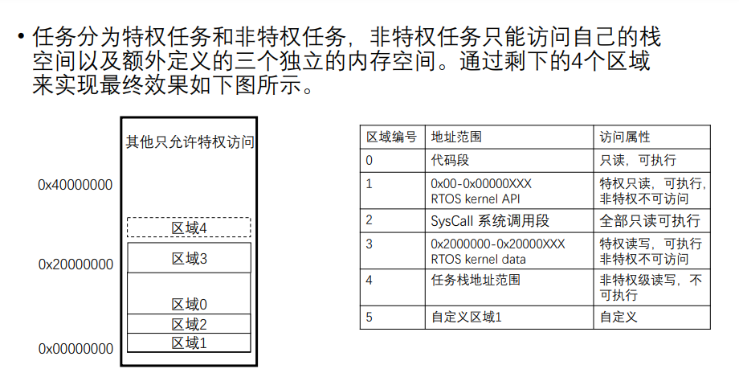

### 测试

在flag2的基础上

换库为task2b.lib

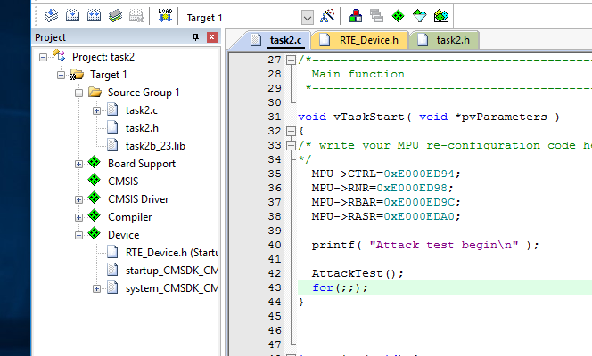

选择project->manage->run-time environment

添加两个外设


重新build后qemu运行

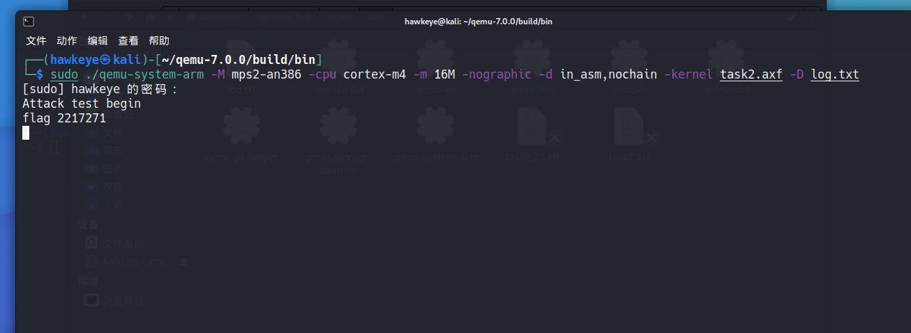


## flag4

### 过程

新建工程 导入文件

和之前的配置一样

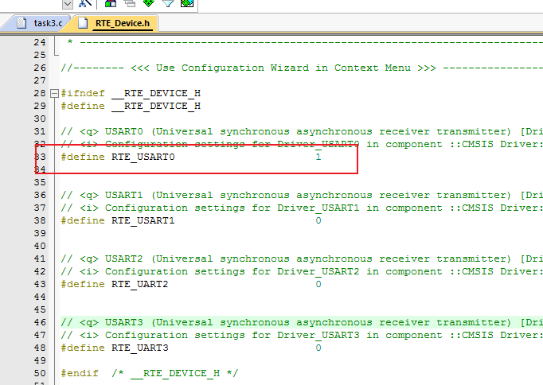

链接sct文件

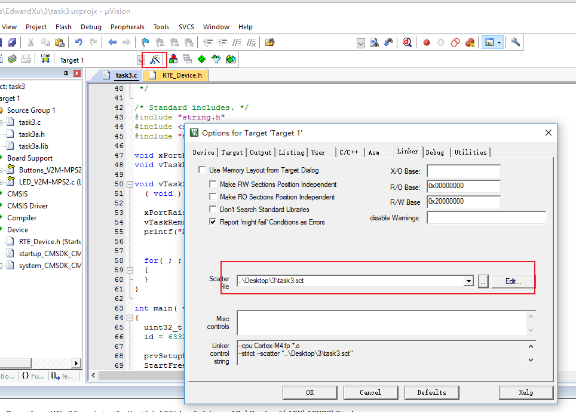

IDA PRO打开文件 找到两个函数


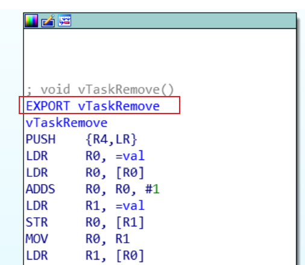

写代码如下


编译成功


### 测试

运行拿到flag

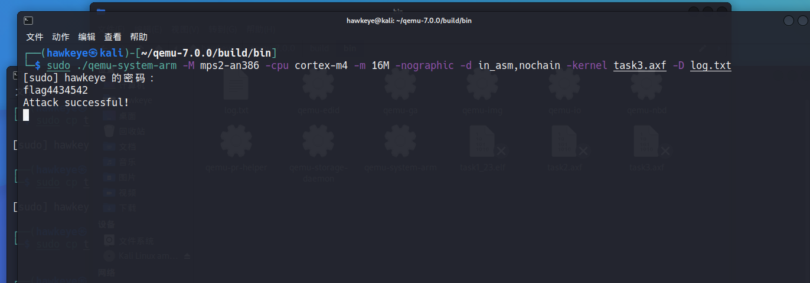

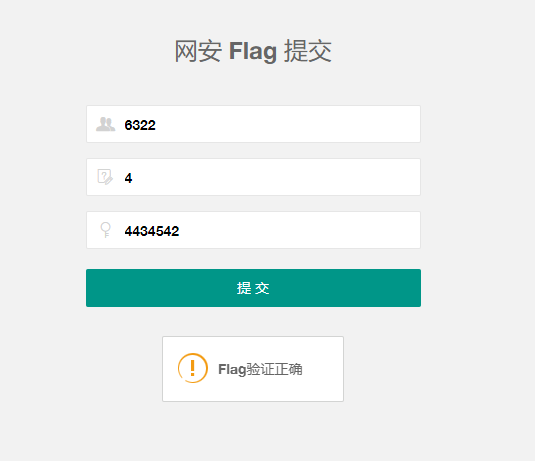

## flag5

### 过程

用idapro7.0 32位打开task3b_23.axf

根据函数名字找到提权函数：


根据引用printf函数找flag函数

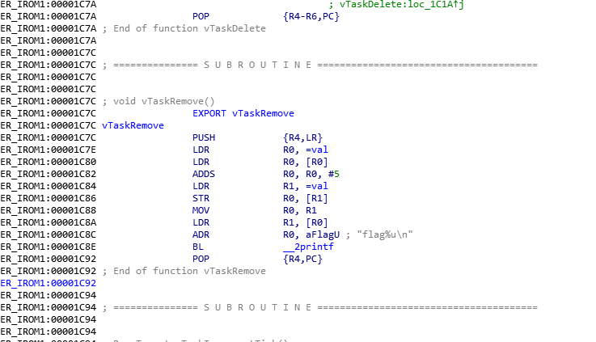

首先调用提权函数，然后调用flag函数

由POP{R4,PC}返回执行，可知每返回一个函数要修改8个字节的栈空间。

根据输入的inputBuffer数组的引用位置，检查函数可以发现在Function函数中存在栈溢出。

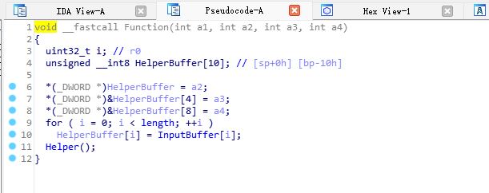

length即为输入的长度参数。

双击上图中的sp+0h 查看栈空间


16进制10=十进制16

栈结束是16进制6=10进制6

16-6=10

考虑对齐 为12 所以

length为24 = 12 + 8(提权函数) + 4(flag函数)，可以正确返回

构造shellcode

>6322
>
>24
>
>0 0 0 0 0 0 0 0 e5 86 00 00 00 00 00 00 7d 1c 00 00

### 测试

运行


